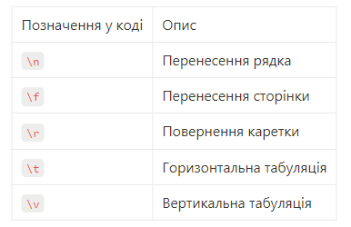

Lesson 1. Вступ у Python

- Синтаксис, змінні, типи даних, оператори
- Робота з рядками та колекції

################################################################################

Lesson 2. Керуючі конструкції. Винятки

- Умовні оператори, цикли
- Функції, область видимості змінних (LEGB)

################################################################################

Lesson 3. Модулі datetime та time. Робота з випадковими величинами

- Модулі datetime та time. Робота з випадковими величинами. Модуль math.

Ключові аспекти: методи роботи з датами і часом

1. datetime.now(): Метод повертає об'єкт datetime, який містить поточну дату та час.
2. datetime.date(): Цей метод повертає об'єкт date, який представляє лише дату (без часу).
3. datetime.time(): Метод повертає об'єкт time, який містить лише час (без дати).
4. datetime.combine(date, time): Цей метод використовується для об'єднання об'єктів date та time і створення нового об'єкта datetime.
5. datetime(year, month, day, hour=0, minute=0, second=0, microsecond=0): Конструктор класу datetime дозволяє створити об'єкт datetime з конкретною датою та часом.
6. weekday(): Метод визначає номер дня тижня для вказаної дати, де понеділок має номер 0, а неділя - 6.

Методи порівняння об'єктів datetime:

• == (рівність): Порівнює, чи є дві дати рівні.
• != (нерівність): Порівнює, чи дві дати не є рівними.
• < (менше): Визначає, чи одна дата передує іншій.
• > (більше): Визначає, чи одна дата наступає за іншою.
• <= (менше або дорівнює): Порівнює, чи одна дата менше або дорівнює іншій.
• >= (більше або дорівнює): Порівнює, чи одна дата більше або дорівнює іншій.

Методи для роботи з ISO форматом дати:

• Метод isoformat() використовується для конвертації об'єкта datetime в рядок у форматі ISO 8601.
• Метод fromisoformat() використовується для конвертації рядка у форматі ISO 8601 в об'єкт datetime.
• Метод isoweekday() використовується для отримання дня тижня відповідно до ISO 8601.
• Метод isocalendar() використовується для отримання кортежу, що містить ISO рік, номер тижня в році та номер дня тижня відповідно до ISO 8601.

Методи для роботи з часовими зонами у Python:

1. Додавання інформації про часову зону до об'єкта datetime:

Метод astimezone використовується для перетворення об'єкта datetime з однієї часової зони в іншу. Наприклад, це може бути використано для конвертації часу з UTC в інші часові зони.

2. Перетворення локального часу в час UTC:

Спочатку призначаємо локальному часу відповідну часову зону.
Використовуємо astimezone для конвертації в UTC. Цей підхід допомагає зручно працювати з локальним та всесвітнім часом.

3. Форматування у форматі ISO 8601 із часовою зоною:

Використовуємо isoformat для отримання рядка з об'єкта datetime у форматі ISO 8601 з часовою зоною. Це корисно для представлення дати та часу у єдиному стандартізованому вигляді.

Oсновні методи модуля time в Python:

1. time.time(): Повертає поточний час у секундах з 1 січня 1970 року (epoch time).
2. time.sleep(seconds): Зупиняє виконання програми на вказану кількість секунд.
3. time.ctime([seconds]): Перетворює часову мітку в текстове представлення, зрозуміле для людини.
4. time.localtime([seconds]): Перетворює часову мітку в структуру struct_time у місцевій часовій зоні.
5. time.gmtime([seconds]): Аналогічно localtime, але повертає struct_time у форматі UTC.
6. time.perf_counter(): Повертає лічильник з високою точністю для вимірювання коротких інтервалів часу.

Mетоди для роботи з випадковими величинами:

• random.randint(a, b): Отримання випадкового цілого числа з рівномірного розподілу в інтервалі між a та b включно.
• random.random(): Отримання випадкового числа в інтервалі між 0.0 (включно) та 1.0 (не включно).
• random.randrange(start, stop[, step]): Отримання випадкового числа з заданого діапазону, з можливістю вказати крок між значеннями.
• random.shuffle(x): Перемішування порядку елементів у списку x.
• random.choice(seq): Вибір випадкового елемента з послідовності seq (списку або кортежу).
• random.choices(population, weights=None, cum_weights=None, k=1): Генерація випадкової вибірки з можливістю зазначити ймовірності для кожного елемента та повторення у вибірці.
• random.sample(population, k): Отримання унікальних випадкових елементів зі списку population довжиною k.
• random.uniform(a, b): Отримання випадкового дійсного числа N такого, що a <= N <= b.

!!! Модуль math

Константи:

math.pi - константа π(приблизно 3.14159...);
math.e - константа e, основа натуральних логарифмів (приблизно 2.71828...);
math.tau - константа τ, дорівнює 2π (приблизно 6.28318...);
math.inf - позначення нескінченності;
math.nan - позначення 'Not a Number' (не число);

Функції округлення чисел:

math.ceil(x) - виконує округлення дійсного числа x до найближчого більшого цілого числа;
math.floor(x) - виконує округлення дійсного числа x до найближчого меншого цілого числа;
math.trunc(x) - виконує обрізання дробової частини дійсного числа x, та повертає цілу частину числа;

Тригонометричні функції

math.sin(x) - синус x, де x в радіанах;
math.cos(x) - косинус x;
math.tan(x) - тангенс x;
math.asin(x) - арксинус x;
math.acos(x) - арккосинус x;
math.atan(x) - арктангенс x;

Експоненційні та логарифмічні функції

math.exp(x) - число e в ступені x;
math.log(x[, base]) - Логарифм x за основою base. Якщо base не вказано, обчислюється натуральний логарифм;

Ступінь та корінь

math.pow(x, y) - x у ступені y;
math.sqrt(x) - квадратний корінь з x;

Деякі інші функції

math.fabs(x) - модуль (абсолютне значення) x;
math.factorial(x) - факторіал числа x;
math.gcd(x, y) - найбільший спільний дільник для x та y;

################################################################################

Lesson 4. Регулярні вирази та розширена робота з рядками

- Регулярні вирази та розширена робота з рядками
  

Основні компоненти регулярних виразів включають:

1. Літерали. Пряме відображення символів (наприклад, a, B, 1).
2. Метасимволи. Символи, які мають спеціальне значення в регулярних виразах (наприклад, . (крапка) відповідає будь-якому символу).
3. Квантифікатори. Визначають, скільки разів елемент повинен відповідати (наприклад \* означає 0 або більше повторень).
4. Класи символів. Визначають групи символів (наприклад, [a-z] відповідає будь-якій малій літері).
5. Групи та діапазони. Використовуються для групування частин виразу (наприклад, (abc) визначає групу символів).
6. Альтернації. Відповідає одному з декількох шаблонів (наприклад, a|b відповідає a або b).
7. Якорі. Визначають позиції у тексті (наприклад, ^ для початку рядка, $ для кінця рядка).

Основні функції модуля re:

1. re.search(pattern, string) - виконує пошук першого входження шаблону в рядку.
2. re.findall(pattern, string) - виконує знаходження всіх входжень шаблону в рядку.
3. re.sub(pattern, repl, string) - виконує заміну входжень шаблону на інший рядок.
4. re.split(pattern, string) виконує розбивання рядка за шаблоном.

Прикладом блоку може бути:

• \w — будь-яка цифра або буква [a-zA-Z0-9_] (\W — все, крім букви або цифри [^a-za-z0-9_])
• \d — будь-яка цифра [0-9] (\D — усе, крім цифри [^0-9])
• \s — будь-який пробільний символ [\t\n\r\f\v] (\S — усе, крім пробільних символів [^\t\n\r\f\v])
• \b — межа слова
• [...] — один із символів у дужках ([^ ] — будь-який символ, крім тих, що в дужках)
• ^ і $ — початок і кінець рядка відповідно
• ( ) — групує вираз і повертає знайдений текст
• \t, \n, \r — символ табуляції, нового рядка та повернення каретки

Модифікатори можуть вказувати на кількість повторень блоку у виразі, наприклад:

• . — один будь-який символ, крім рядка \n
• ? — 0 або 1 входження шаблону зліва
• + — 1 і більше входжень шаблону зліва
• \* — 0 і більше входжень шаблону зліва
• \ — екранування спец.символів (приклад: \. — означає крапку або \+ — знак "плюс")
• {n} суворо n разів (n ціле число)
• {n,m} — від n до m входжень (приклад: {,m} — від 0 до m)
• a|b — відповідає a або b. Сам символ | означає "або" між двома шаблонами
• ( ) — групує вираз і повертає знайдений текст

################################################################################

Lesson 5. Робота з файлами та обробка виключень

- Робота з файлами та обробка виключень
  Функція open() повертає файловий об'єкт, який далі може бути використаний для читання з файлу або запису в нього.

open(file, mode='r', buffering=-1, encoding=None, errors=None, newline=None, closefd=True, opener=None)

Параметри:

• file - шлях до файлу у вигляді рядка. Це може бути повний шлях або шлях відносно поточного каталогу виконання.
mode (необов'язковий) - режим, в якому буде відкрито файл. Ось основні режими які ми будемо використовувати:
• 'r' - читання (за замовчуванням). Файл має існувати.
• 'w' - запис. Створює новий файл або перезаписує, що вже існує.
• 'a' - додавання. Дописує в кінець файлу, не перезаписуючи його.
• 'b' - бінарний режим (може бути використаний разом з іншими, наприклад 'rb' або 'wb').
• '+' - оновлення (читання та запис).
• buffering (необов'язковий) - визначає буферизацію: 0 для вимкненої, 1 для включеної буферизації рядків, більше 1 для вказання розміру буфера у байтах.
• encoding (необов'язковий) - ім'я кодування, яке буде використовуватися для кодування або декодування файлу.
• errors (необов'язковий) - вказує, як обробляти помилки кодування.
newline (необов'язковий) - контролює, як обробляються нові рядки.
• closefd (необов'язковий) - має бути True (за замовчуванням); якщо вказано False, файловий дескриптор не буде закритий.
• opener (необов'язковий) - визначає спеціальну функцію для відкриття файлу.

Менеджер контексту в Python - це спосіб використання ресурсів, який автоматично забезпечує правильне закриття файлу, незалежно від того, чи виникла помилка чи ні. Це робить код не тільки більш читабельним, але й безпечнішим.
with open('text.txt', 'w') as fh: # Виконання операцій з файлом
fh.write('Some data')
Файл автоматично закриється після виходу з блоку with

Робота з не текстовими файлами у Python

Щоб працювати з послідовністю байтів у Python є вбудовані типи даних байт-рядків

- bytes - незмінний тип, що використовують для представлення байтів.
- bytearray - змінний тип, що дозволяє модифікувати байти після їх створення.

################################################################################

Lesson 6. Робота з модулями та створення віртуального оточення

- Робота з модулями та створення віртуального оточення

################################################################################

Lesson 7.

-

################################################################################

Lesson 8.

-

################################################################################

Lesson 9.

-

################################################################################

Lesson 10.

-

################################################################################

Lesson 11.

-

################################################################################

Lesson 12.

-
